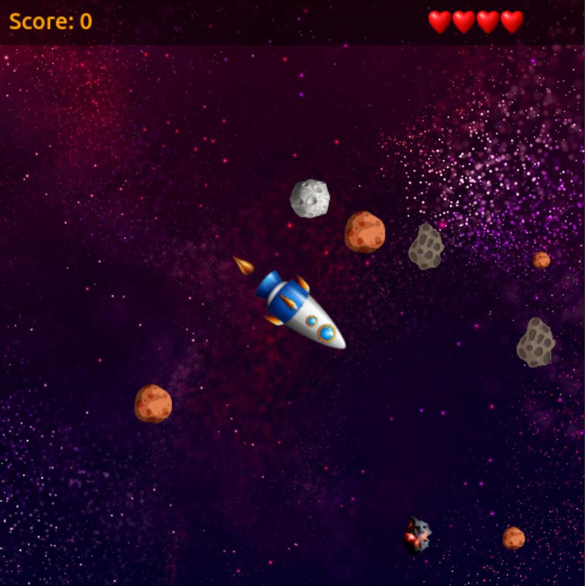
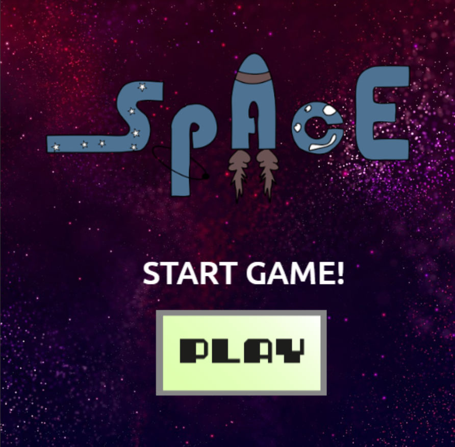
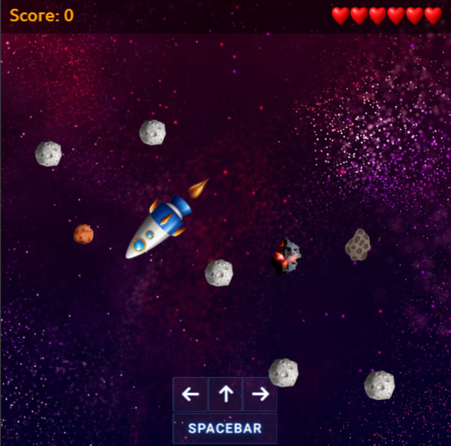

## Space Shooter
The game created using `HTML5` `Canvas` `Vanilla JS`.

## Demo
Click the on the poster and to see a demo

## Screenshots
|  |  |
|---------------------------------------------|---------------------------------------------|

## Game Features

- Health bar for the rocket
- Score for check your achievements
- Theme music and custom sounds
- Sprite animation
   - asteroid flying
   - bullet shoots
   - rocket fire burning
- 6 lives per game
- Fun to play :)

## Controls
|              | Button              |
|--------------|---------------------|
| Move         | <kbd>Up</kbd>       |
| Turn Left    | <kbd>left</kbd>     |
| Turn Right   | <kbd>right</kbd>    |
| Fire bullets | <kbd>spacebar</kbd> |

## How to play
- Online:
  - Go to [this link](https://petrischakmaxim.github.io/space-shooter/)
- Your PC:
  - Download this repository
  - Install [Node JS](https://nodejs.org/en/download)
  - Enter `npm i`
  - Enter `npm run serve`
  