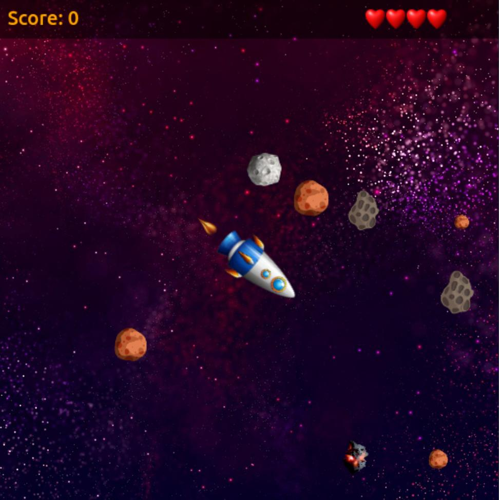
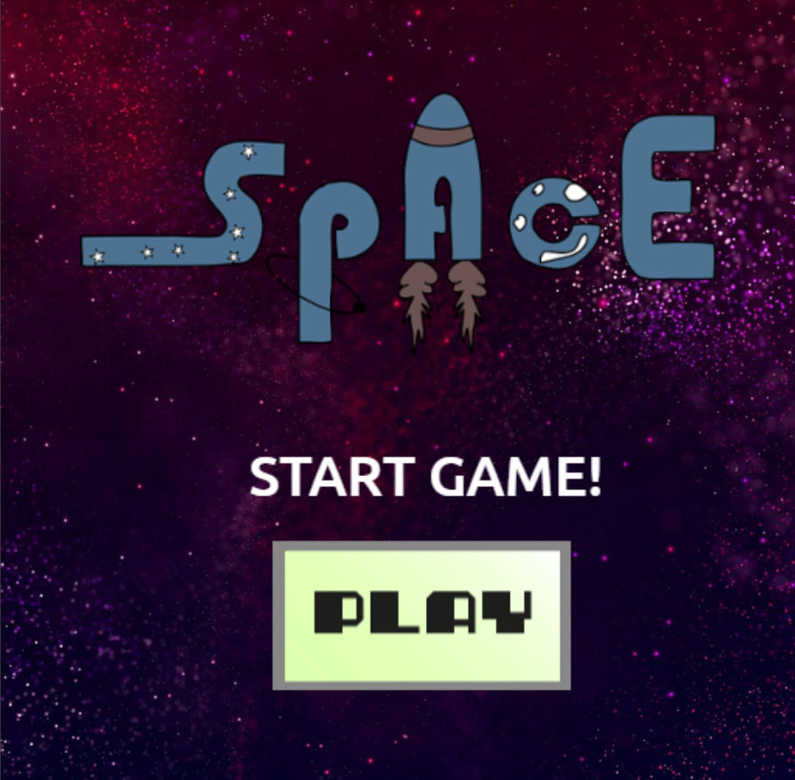
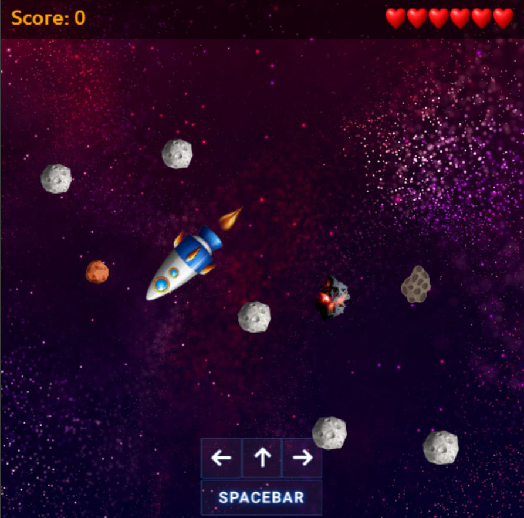

# Space Shooter

A modular HTML5 Canvas arcade shooter built with vanilla JavaScript and a custom game engine. The project showcases sprite-based rendering, scene composition, asset loading, collision handling, and responsive user controls.

## Features
- Custom canvas-based game engine with start, gameplay, and end scenes
- Asset loader for images, sound effects, and UI sprites
- Rocket movement with rotation, thrust, friction, and live particle exhaust
- Bullet firing and asteroid collision detection for score-based gameplay
- Health bar, score tracking, and win/lose state transitions
- Responsive canvas scaling and pointer-aware button interactions

## Tech Stack
- HTML5 Canvas API
- Vanilla JavaScript (ES modules)
- Webpack for bundling and development server
- Custom engine modules for rendering, collision, input, and tweening

## Demo
Click the poster to view a demo:
[](https://youtu.be/MTrX7byllUQ)

## Screenshots
|  |  |
|---------------------------------------------|---------------------------------------------|

## Controls
| Action       | Input |
|--------------|-------|
| Thrust       | <kbd>Up</kbd> |
| Rotate left  | <kbd>Left</kbd> |
| Rotate right | <kbd>Right</kbd> |
| Fire bullets | <kbd>Spacebar</kbd> |

## Installation
1. Clone the repository
2. Install dependencies:
```bash
npm install
```
3. Start the local server:
```bash
npm run serve
```
4. Open `http://localhost:9000/`

## Project Purpose
This is a frontend game prototype intended to demonstrate browser game architecture using a lightweight custom engine, asset management, and interactive Canvas rendering.

## Notes
- The game is built without external game frameworks, relying on hand-crafted modules for rendering, collisions, and input.
- It is a strong starting point for adding additional enemy patterns, levels, and polish for portfolio presentation.

  